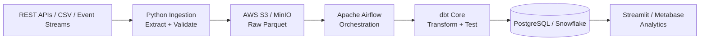

# 🏗️ Cloud Data Platform

[](https://github.com/AloneRider-pixel/cloud-data-platform/actions/workflows/ci.yml)
[](https://github.com/AloneRider-pixel/cloud-data-platform/actions/workflows/codeql.yml)
[](LICENSE)

**End-to-end data engineering platform for batch and streaming ingestion, orchestration, transformation, data quality, and analytics.**

> **Portfolio focus:** data engineering + ETL/ELT + Airflow + dbt + AWS + warehouse modeling + data quality.

## Architecture



## What this project demonstrates

### Ingestion
- Paginated REST API ingestion with retries and rate limiting.
- Multi-file CSV ingestion with schema validation.
- Simulated event-stream ingestion.
- Watermark-based incremental loading.
- Idempotent load patterns to make pipeline reruns safe.

### Orchestration
- Batch and incremental Airflow DAGs.
- Scheduled API ingestion with backfill support.
- Post-load data-quality orchestration.
- Retry and alerting hooks.
- Pipeline-level monitoring and SLA tracking.

### Transformation
- dbt staging → intermediate → analytics layers.
- Incremental models with merge strategies.
- Schema, uniqueness, null, relationship, and accepted-value tests.
- Reusable Jinja macros.
- Model documentation and metadata.

### Data quality
- Schema-drift detection.
- Source-to-target row-count reconciliation.
- Freshness checks.
- Distribution/anomaly checks.
- Automated quality gates in the pipeline.

### Infrastructure
- Docker Compose for local development.
- AWS S3-compatible raw-data storage.
- PostgreSQL and Snowflake warehouse targets.
- GitHub Actions for CI/CD.

## Data layers

| Layer | Purpose |
|---|---|
| **Bronze / Raw** | Source-aligned Parquet data with partitioning and auditability |
| **Silver / Clean** | Deduplication, validation, type normalization, integrity checks |
| **Gold / Analytics** | Business-ready models, aggregates, KPIs, and BI-oriented schemas |

## Technology stack

| Layer | Technology |
|---|---|
| Ingestion | Python 3.11, Requests, Pandas, PyArrow |
| Orchestration | Apache Airflow 2.8 |
| Transformation | dbt Core 1.7 |
| Storage | AWS S3, MinIO |
| Warehouse | PostgreSQL 16, Snowflake |
| Quality | dbt tests, custom SQL assertions |
| Dashboard | Streamlit |
| Infrastructure | Docker, GitHub Actions, AWS |

## Repository structure

```text
cloud-data-platform/
├── ingestion/
│   ├── src/
│   │   ├── extractors/
│   │   ├── loaders/
│   │   ├── validators/
│   │   └── transforms/
│   └── tests/
├── airflow/
│   ├── dags/
│   ├── plugins/
│   └── config/
├── dbt/
│   ├── models/
│   │   ├── staging/
│   │   ├── intermediate/
│   │   └── analytics/
│   ├── tests/
│   ├── macros/
│   └── snapshots/
├── warehouse/
├── dashboard/
├── monitoring/
├── scripts/
├── tests/
├── .github/workflows/ci.yml
├── docker-compose.yml
└── README.md
```

## Local development

### Prerequisites

- Docker + Docker Compose
- Python 3.11+
- AWS credentials for real S3 usage (optional; MinIO can be used locally)

### Start services

```bash
git clone https://github.com/AloneRider-pixel/cloud-data-platform.git
cd cloud-data-platform
cp .env.example .env
docker-compose up -d
```

The local stack provides PostgreSQL, MinIO, Airflow, and the Streamlit dashboard.

### Run the pipeline

```bash
docker-compose exec ingestion python -m src.loaders.seed_data

docker-compose exec airflow-webserver airflow dags trigger etl_batch_pipeline
docker-compose exec airflow-webserver airflow dags trigger api_ingestion_pipeline

docker-compose exec dbt dbt run --profiles-dir /root/.dbt
docker-compose exec dbt dbt test --profiles-dir /root/.dbt
```

Dashboard: `http://localhost:8501`

Airflow: `http://localhost:8080`

## Pipeline targets

These values are **design targets**, not published benchmark results:

| Metric | Target |
|---|---:|
| Batch ETL runtime | `< 15 min` |
| Incremental load | `< 2 min` |
| Data-quality pass rate | `> 99%` |
| Pipeline success rate | `> 99.5%` |
| Data freshness SLA | `< 1 hour` |

When publishing measured performance, pair the number with dataset size, environment, run count, and reproducible benchmark instructions.

## Verification

The recommended technical review path is documented in [Reviewer Guide](docs/reviewer-guide.md). The data-quality assumptions and replay/benchmark checklist are in [Data Quality Verification](docs/data-quality.md).

CI currently verifies ingestion lint/tests, dbt parsing/compilation, Docker builds, and CodeQL analysis.

## Testing

The repository separates ingestion unit tests from broader integration tests and dbt/data-quality checks. CI runs automated quality gates through GitHub Actions.

## Roadmap

- Managed-cloud deployment example with least-privilege IAM.
- Automated data-lineage visualization.
- Incremental Snowflake optimization benchmarks.
- Great Expectations integration alongside dbt checks.
- Production-style alerting and observability examples.

## Evidence and reproducibility

Pipeline targets in this README are design targets, not measured production benchmarks. Any published runtime, throughput, freshness, quality, or reliability result should link to a reproducible dataset/workload, environment, command or workflow, sample size, and commit-produced artifact.

See [Evidence Policy](docs/evidence-policy.md).

## License

MIT
