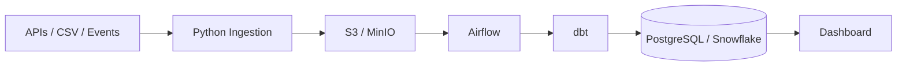

# 🏗️ Cloud Data Platform

[](https://github.com/AloneRider-pixel/cloud-data-platform/actions/workflows/ci.yml)
[](https://github.com/AloneRider-pixel/cloud-data-platform/actions/workflows/codeql.yml)
[](LICENSE)

End-to-end data engineering platform for ingestion, orchestration, transformation, data quality, and analytics.

## What it demonstrates

- Paginated API, CSV, and event-style ingestion with validation, retries, and rate limiting.
- Incremental and idempotent loading patterns.
- Apache Airflow orchestration with scheduled batch and incremental pipelines.
- dbt transformation and data-quality checks.
- Bronze → Silver → Gold warehouse modeling.
- Dockerized local infrastructure and CI validation.

## Architecture


```mermaid
graph LR
    SRC[APIs / CSV / Events] --> ING[Python Ingestion]
    ING --> RAW[S3 / MinIO]
    RAW --> AIR[Airflow]
    AIR --> DBT[dbt]
    DBT --> WH[(PostgreSQL / Snowflake)]
    WH --> BI[Dashboard]
```

## Data layers

| Layer | Purpose |
|---|---|
| Bronze / Raw | Source-aligned data with auditability |
| Silver / Clean | Validation, deduplication, normalization |
| Gold / Analytics | Business-ready models and KPIs |

## Stack

| Layer | Technology |
|---|---|
| Ingestion | Python 3.11, Requests, Pandas, PyArrow |
| Orchestration | Apache Airflow |
| Transformation | dbt Core |
| Storage | AWS S3 / MinIO |
| Warehouse | PostgreSQL / Snowflake |
| Quality | Pytest, dbt tests, SQL assertions |
| Delivery | Docker, GitHub Actions |

## Repository layout

```text
ingestion/
  src/extractors/
  src/loaders/
  src/validators/
  tests/
airflow/dags/
dbt/
  dbt_project.yml
  macros/
warehouse/schemas/
dashboard/
scripts/
docs/
.github/workflows/
```

## Quick start

Prerequisites: Docker Compose and Python 3.11+.

```bash
git clone https://github.com/AloneRider-pixel/cloud-data-platform.git
cd cloud-data-platform
cp .env.example .env
docker compose up -d
```

For real S3 usage, provide the required AWS credentials. MinIO is the local S3-compatible path.

## Verification

CI validates ingestion and dbt paths. Core local checks:

```bash
cd ingestion
ruff check src/
pytest tests/ -v --cov=src

cd ../dbt
dbt parse --profiles-dir .
dbt compile --profiles-dir .
```

## Data-quality discipline

The pipeline is designed around schema validation, row-count reconciliation, freshness checks, and replay-safe loading. Performance values in this README are design targets unless accompanied by reproducible evidence.

## Evidence and reproducibility

Any published runtime, throughput, freshness, or quality result should include dataset/workload, environment, tooling, sample/run count, command, and producing commit. See [Evidence Policy](docs/evidence-policy.md).

## Roadmap

- Managed-cloud deployment examples with least-privilege IAM.
- Richer lineage visualization.
- Snowflake performance benchmarks with reproducible workloads.
- Extended data-quality integrations.

## Review path

Read [architecture](docs/architecture.md), [data quality](docs/data-quality.md), [verification](docs/verification.md), and [reviewer guide](docs/reviewer-guide.md) before changing ingestion, warehouse contracts, or quality gates.

## Maintenance standard

Keep ingestion idempotent, schemas explicit, credentials out of source control, and data-quality failures visible.

## License

MIT
