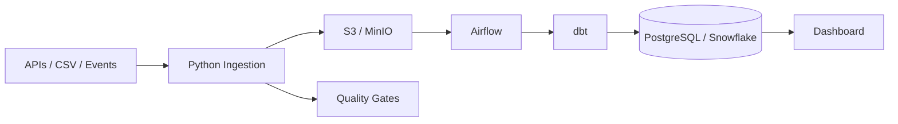

# Cloud Data Platform

[](https://github.com/AloneRider-pixel/cloud-data-platform/actions/workflows/ci.yml)
[](https://github.com/AloneRider-pixel/cloud-data-platform/actions/workflows/codeql.yml)
[](LICENSE)

End-to-end data-engineering reference platform for ingestion, orchestration, transformation, validation, warehouse modeling, and analytics.

## What it demonstrates

- Paginated API, CSV, and event ingestion with validation and replay-safe loading.
- Incremental and idempotent processing.
- Airflow orchestration for batch and incremental workloads.
- dbt transformations and warehouse modeling.
- Bronze → Silver → Gold data layers.
- Schema, freshness, reconciliation, and data-quality gates.
- Dockerized local infrastructure plus CI, CodeQL, dependency review, and Scorecard.

## Architecture


```mermaid
graph LR
    SRC[APIs / CSV / Events] --> ING[Python Ingestion]
    ING --> RAW[S3 / MinIO]
    RAW --> AIR[Airflow]
    AIR --> DBT[dbt]
    DBT --> WH[(PostgreSQL / Snowflake)]
    WH --> BI[Dashboard]
    ING --> Q[Quality Gates]
```

## Stack

| Layer | Technology |
|---|---|
| Ingestion | Python 3.11, Requests, Pandas, PyArrow |
| Orchestration | Apache Airflow |
| Transformation | dbt Core |
| Object storage | AWS S3 / MinIO |
| Warehouse | PostgreSQL / Snowflake |
| Quality | Pytest, dbt tests, SQL assertions |
| Delivery | Docker, GitHub Actions |

## Repository map

```text
ingestion/
  src/extractors/
  src/loaders/
  src/validators/
  tests/
airflow/dags/
dbt/
warehouse/schemas/
dashboard/
scripts/
docs/
.github/workflows/
```

## Quick start

Prerequisites: Docker Compose and Python 3.11+.

```bash
git clone https://github.com/AloneRider-pixel/cloud-data-platform.git
cd cloud-data-platform
cp .env.example .env
docker compose up -d
```

Use MinIO for a local S3-compatible workflow. Provide real AWS credentials only when connecting to AWS.

## Verification

```bash
cd ingestion
ruff check src/
pytest tests/ -v --cov=src

cd ../dbt
dbt parse --profiles-dir .
dbt compile --profiles-dir .
```

CI also validates container builds, ingestion tests, dbt validation, CodeQL, dependency review, and Scorecard.

## Data-quality contract

A successful pipeline run means the configured validation gates passed. Preserve schema validation, row-count reconciliation, freshness controls, and idempotency when extending ingestion or transformation behavior.

## Reliability notes

Eventual consistency, partial ingestion, replay, and duplicate delivery are treated as normal failure modes. New loaders should make their write path replay-safe and observable rather than assuming one successful execution.

## Security

Keep cloud credentials outside source control. Review IAM scope, object-store permissions, database credentials, and ingestion boundaries together. CI uses immutable action references and least-privilege workflow permissions.

## Evidence policy

Runtime, throughput, freshness, quality, and cost claims require a named workload/dataset, environment, measurement method, sample/run count, and producing commit. Synthetic fixtures are not production benchmarks.

See [docs/evidence-policy.md](docs/evidence-policy.md).

## Documentation

- [Architecture](docs/architecture.md)
- [Data quality](docs/data-quality.md)
- [Verification](docs/verification.md)
- [Reviewer guide](docs/reviewer-guide.md)

## Contribution standard

Preserve data contracts and quality gates when changing ingestion schemas, orchestration, or warehouse models. Add regression coverage for idempotency and reconciliation behavior.

## Roadmap

Lineage visualization, managed-cloud examples, reproducible Snowflake benchmarks, and broader data-quality integrations.

## License

MIT
