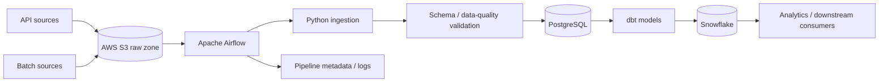

# Cloud Data Platform Architecture

## Design goals

- Separate ingestion, validation, transformation, and analytical serving concerns.
- Make pipeline retries safe through idempotent processing and deterministic transformations.
- Validate schemas and data quality before downstream publication.
- Keep orchestration, transformation code, and warehouse models independently testable.

## Operational checks

CI validates ingestion code, dbt parsing/compilation, and Docker builds before changes are considered ready.
